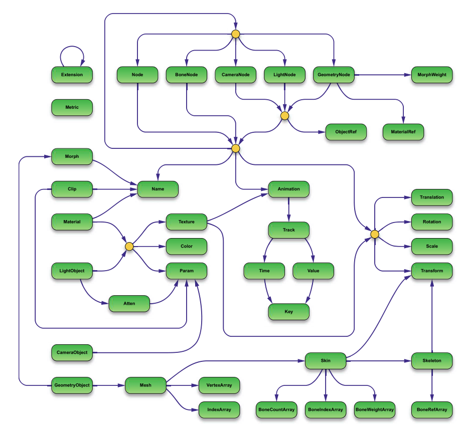

# Game Engine Gems 3

The book details a number of clever tricks and useful wisdom for building game engines like the pros. It is written by 22 industry veterans and is separated into four general topics

  - Graphics and Rendering
  - Physics
  - General Programming
  - Character Control and Artificial Intelligence

Chapters are written by different developers.

## Graphics and Rendering

### The Open Game Engine Exchange Format
This format, called `OpenGEX` facilitates import/export of scene information. The format is supported by 3DS Max and Maya. It consists of a number structures that may contain each other based on a set of rules. The rules are best illustrated in the image below.

  

 To manage these files a small language called `OpenDDL` was written. The purpose was to provide a human-readable generic syntax for expressing data. It resembles C/C++ with elements of JSON.
