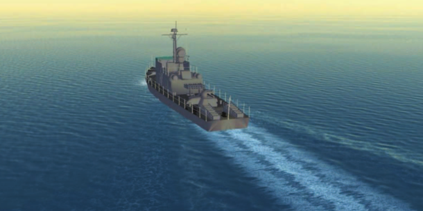
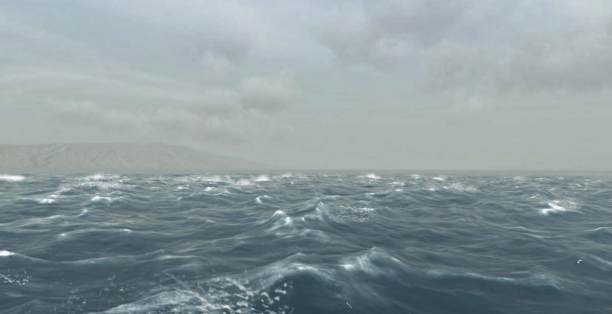

# Game Engine Gems 3

The book details a number of clever tricks and useful wisdom for building game engines like the pros. It is written by 22 industry veterans and is separated into four general topics

  - Graphics and Rendering
  - Physics
  - General Programming
  - Character Control and Artificial Intelligence

Chapters are written by different developers.

## Graphics and Rendering

### 1 The Open Game Engine Exchange Format
This format, called `OpenGEX` facilitates import/export of scene information. The format is supported by 3DS Max and Maya. It consists of a number structures that may contain each other based on a set of rules. The rules are best illustrated in the image below.

  

 To manage these files a small language called `OpenDDL` was written. The purpose was to provide a human-readable generic syntax for expressing data. It resembles C/C++ with elements of JSON. The rest of the chapter specifies the format in great detail.

## 2 Realistic Blending of Skies, Water, and Terrain
Simulating horizons and correct sky colours is very difficult and depends on many variables. It is therefore not viable to calculate these things in real time. Instead, this chapter proposes a number of short cutst that can be used to approach realistic behaviour at reduced computational cost. Each method has different trade-offs.

  

    
  

  

    
  

Another aspect of reducing visiblity at range is fog. The colour of the sky greatly affects whether or not fog looks real. Therefore the calculation of the skys colour and the that of the fog is closely related. This can be done by rendering the sky on a cube map or sky box and then using the sky in tandem with the terrain to calculate the approprioate fog colour.

The techniques can be applied in unisin to achieve the image on the right hand side.
