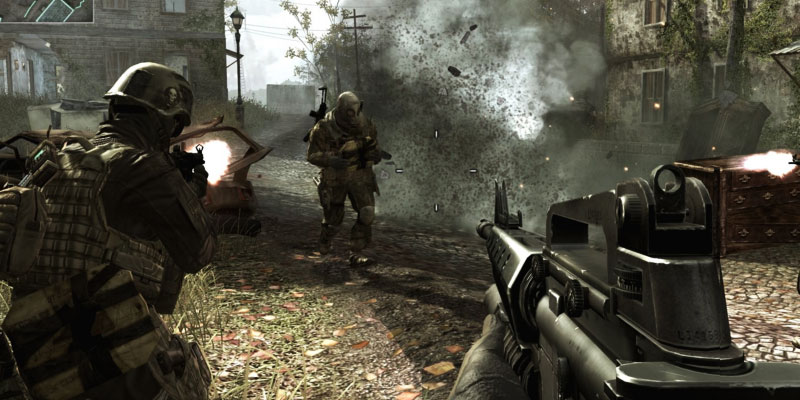

# Startopgave: FPS Controller
I denne opgave skal du implementere en noget kode, som kan bevæge en spiller rundt i verdenen, som kendt fra first person shooter (FPS) spil (se billedet).

 Vi har lavet en tom `FPSController` klasse i scenen `FPS Controller`, som du skal tilføje koden til. Opgaven er løst når du kan starte spille og gøre følgende:

1) Bevæge dig rundt i verdenen med piletasterne eller WASD.
2) Rotere kameraet ved bevægelse af musen.